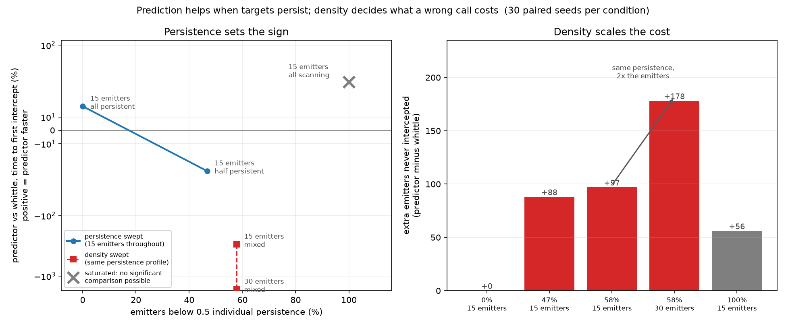

# When is prediction-led exploitation safe?

_Generated by `scripts/persistence_figure.py`, 30 paired seeds per condition._

| emitters below 0.5 persistence | scenario | det. duty | Δ intercept time | Δ emitters missed |
|---|---|---|---|---|
| 0.0% | 15 emitters, all persistent | 0.1172 | +18.0% | +0 |
| 46.7% | 15 emitters, half persistent | 0.0631 | -30.2% | +88 |
| 57.8% | 30 emitters, mixed | 0.1176 | -1660.2% | +178 |
| 57.8% | 15 emitters, mixed | 0.0604 | -297.5% | +97 |
| 100.0% | 15 emitters, all scanning _(saturated)_ | 0.0013 | +35.9% | +56 |

Δ is `predictor` against `whittle`; positive intercept time means the predictor
is faster, positive missed means it loses more emitters.

**Persistence sets the sign.** Holding the emitter count at 15 and the
live-channel count fixed, swinging composition from all-persistent to half
takes the predictor's intercept-time advantage from **+18.0% to −30.2%**. No
change in density is involved.

**Density scales the magnitude.** The two 57.8% rows have *identical*
persistence profiles and differ only in emitter count. The sign does not move;
the penalty goes from **−297.5% to −1660.2%** and the excess emitters missed
from **97 to 178**.

**The all-scanning anchor is a different regime, not a third trend point.**
Its detectable duty is 0.0013 and `whittle`'s median time to first intercept is
infinite -- more than half the emitters are never intercepted by any policy --
so neither comparison there reaches significance. Folding it into the trend
would disguise a degenerate ceiling as a continuation of the effect.

**Why per-emitter persistence and not the pooled statistic.** At half
persistent emitters the pooled figure reads 0.99, because the always-on
emitters contribute nearly every detectable cell while the scanners hiding
behind them are precisely the ones being missed. Any online estimator faces the
same trap: it has to estimate the persistence *distribution*, not its average.
