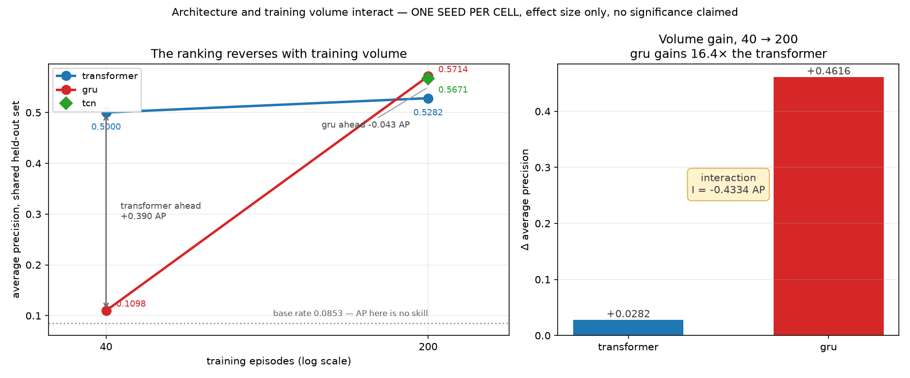

# Volume × architecture: the ranking is not stable

_All five checkpoints scored on **one** held-out set, built from 40 reserved
seeds (900000–900039) that no arm trains on. Base rate **0.0852822** for every
arm — that identity is what makes these five numbers one measurement. Student
path only; the teacher sees privileged state and is not deployable._



## Common held-out scores

| architecture | volume | AP | AUC |
|---|---|---|---|
| transformer | 40 ep | 0.5000 | 0.7403 |
| gru | 40 ep | **0.1098** | **0.5146** |
| transformer | 200 ep | 0.5282 | 0.7638 |
| gru | 200 ep | **0.5714** | 0.7929 |
| tcn | 200 ep | 0.5671 | 0.7880 |

## Within-architecture volume effect (40 → 200)

| architecture | AP 40 | AP 200 | Δ | relative |
|---|---|---|---|---|
| transformer | 0.5000 | 0.5282 | **+0.0282** | +5.6% |
| gru | 0.1098 | 0.5714 | **+0.4616** | +420.3% |

## Within-volume architecture effect (transformer − gru)

| volume | Δ AP | ahead |
|---|---|---|
| 40 ep | **+0.3902** | transformer |
| 200 ep | **−0.0432** | gru |

**The ranking reverses.** At 40 episodes the transformer leads by 0.39 AP; at
200 the GRU leads by 0.04.

## Interaction

```
I = [P_T(200) − P_T(40)] − [P_G(200) − P_G(40)]
  = (+0.0282) − (+0.4616)
  = −0.4334 AP
```

The GRU gains **16.4×** what the transformer gains from the same 5× increase
in training volume. The interaction term is an order of magnitude larger than
the transformer's entire volume effect, and larger than either architecture
effect.

The mechanism is visible in the 40-episode cell: the GRU scores **AP 0.1098
against a base rate of 0.0853, at AUC 0.5146** — it is essentially
non-predictive there, not merely worse. The transformer is already at 0.5000.
So this is not two architectures improving at different rates; it is one
architecture that does not function at low volume and one that does.

## What this settles, and what it does not

**Observed: a large architecture x training-volume interaction, in this
one-seed experiment.** That is the whole claim, and the qualifier is part of
it. A statement of the form "architecture X is better" or "more data helps by
Y%" is unsafe in this setting, because in the four cells measured each
depends on the level of the other factor — but "unsafe here" is a caution
about quoting a single number, not a demonstration that no main effect
exists. The
quarantined claim — that full-corpus training improved prediction — is
therefore *not* rehabilitated as a corpus effect. It was measured on a GRU,
which is the architecture that happens to be extremely volume-sensitive, so
the improvement it reported is an interaction observed at one corner.

**Not settled: significance.** This is **one seed per cell**. The direction
and effect size are reported; no paired test is possible, and none is claimed.
For contrast, the persistence result carries 30 paired seeds per condition
with bootstrap intervals and Wilcoxon p-values. Raising this to that standard
means rerunning all four cells across seeds, which is a separate budget
decision.

**Infeasible, not missing: the 400-episode condition.** Both 400-episode arms
were attempted and produced no checkpoint. Window building for 400 episodes at
200 windows each requires roughly 21 GB, beyond the training memory budget
available. This is recorded as a feasibility limit of the setup rather than as
absent data. The 40 → 200 intervention is a 5× change in training volume and
is informative without it.

## This does not touch the deployment decision

The production architecture was selected by an **independent end-to-end
latency gate**, not by any accuracy ranking:

```
Deployable(m) = p99 forward(m) + 0.6 ms overhead ≤ 3.00 ms
```

The GRU fails that gate on CPU (60.5 ms) and on GPU (3.2 ms), so it is
excluded regardless of where the accuracy ranking lands at any volume. See
[arch_latency.md](arch_latency.md).

The two questions stay separate on purpose:

* **What predicts best?** — no ranking held across both volumes tested, so
  no single answer is quotable from this experiment.
* **What can ship?** — the transformer, decided by timing feasibility alone.

`tcn` at 200 episodes (AP 0.5671) sits within 0.004 of the GRU while passing
the gate on GPU, which is consistent with the architecture control's finding
that it ties the GRU. Its low-volume behaviour is unmeasured, so whether it
shares the GRU's volume sensitivity is an open question — and not one worth
spending budget on, since the architecture chapter is closed.
